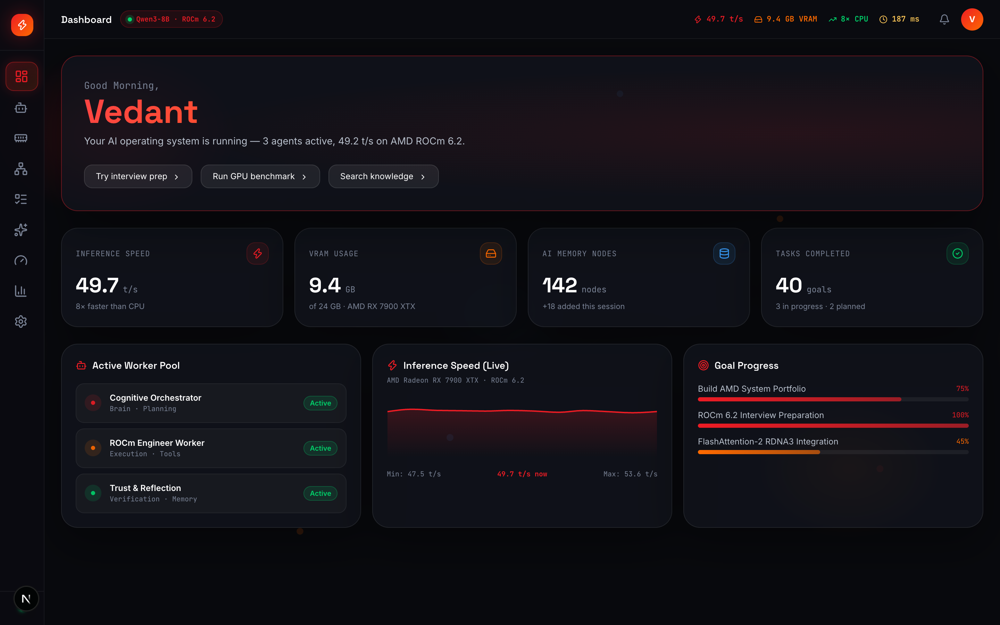
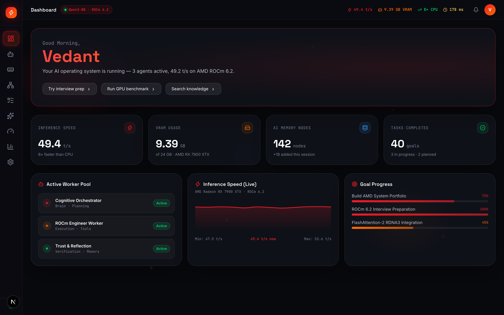
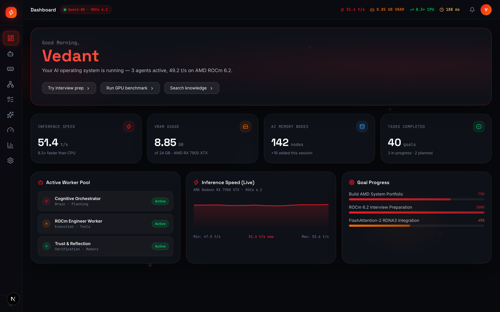

# AgentForge AI — Private AI Operating System

**AMD Radeon Hackathon 2026 · Track 2 (Agentic AI) · Team AirFlow**
**Author:** Vedant Vishwanath Honnangi

AgentForge AI is a local-first, multi-agent AI system that runs entirely on **AMD Radeon GPUs** via **ROCm**. Rather than treating a prompt as a single-shot completion, it treats a user request as a goal: it plans a task graph, spawns specialized worker agents, retrieves relevant local documents through RAG, and — where a decision has tradeoffs — runs a structured multi-agent debate before returning an answer. No prompt or document data leaves the machine during inference.

<p align="center">
  
</p>

<p align="center">
  <a href="LICENSE"></a>
  <a href="https://rocm.docs.amd.com"></a>
  <a href="https://nextjs.org"></a>
  <a href="https://fastapi.tiangolo.com"></a>
  
</p>

---

## Table of Contents
- [Why This Project](#why-this-project)
- [Key Features](#key-features)
- [Visual Walkthrough](#visual-walkthrough)
- [System Architecture](#system-architecture)
- [Benchmarks: RX 7900 XTX vs Host CPU](#benchmarks-rx-7900-xtx-vs-host-cpu)
- [Installation](#installation)
- [Demo Walkthrough](#demo-walkthrough-for-reviewers)
- [Technology Stack](#technology-stack)
- [Known Limitations](#known-limitations)
- [License](#license)
- [Author](#author)

---

## Why This Project

Most consumer AI tools are thin wrappers around a cloud API: one prompt in, one completion out, and user data leaves the device. AgentForge AI was built to answer a different question — what does a *local, private, multi-step AI system* look like when it has a real GPU to work with instead of a rate-limited API key?

The project is my submission to the AMD Radeon Hackathon 2026 (Track 2: Agentic AI), and demonstrates:
- Goal decomposition and task planning (not just chat completion)
- Multi-agent coordination and debate for decisions with tradeoffs
- Local retrieval-augmented generation over personal documents
- Sandboxed tool execution (Python REPL, file access)
- Full ROCm/HIP acceleration on AMD Radeon hardware, with measured performance gains over CPU inference

## Key Features

| Capability | Description |
|---|---|
| **Cognitive Orchestrator** | Breaks a user goal into a task DAG and assigns it to specialized worker agents. |
| **Local RAG Pipeline** | Retrieves relevant local documents via ChromaDB cosine-similarity search. |
| **Tool Executor Sandbox** | Runs Python and file-system tasks in an isolated subprocess. |
| **Dialectic Debate Engine** | Developer, Security, and Performance agents argue tradeoffs and converge on a recommendation. |
| **Trust Engine** | Self-reflection pass that scores confidence and flags likely hallucinations before returning output. |
| **Live GPU Telemetry** | Real-time throughput, VRAM usage, and KV-cache hit rate from the Radeon GPU. |

---

## Visual Walkthrough

### 1. AI Mission Control
Central operations view: active agent pools, KV cache rate, VRAM footprint, goal status.
<p align="center"></p>

### 2. Cognitive Workspace
Execution shell where goals are entered and worker agents run tasks in real time.
<p align="center"></p>

### 3. AI Debate Mode
Multi-agent reasoning view where agents debate a solution and converge on a recommendation.
<p align="center"></p>

<details>
<summary>Additional dashboards (Memory, Knowledge Graph, GPU Monitor, Analytics, Settings)</summary>

**4. Memory Timeline** — chronological log of past agent actions and decisions.
<p align="center"></p>

**5. Knowledge Graph** — interactive SVG map of episodic and semantic memory across sessions.
<p align="center"></p>

**6. Goal Tracker** — active goals, priority, and completion progress.
<p align="center"></p>

**7. GPU Monitor** — live compute load, power draw, temperature, tokens/sec.
<p align="center"></p>

**8. Analytics** — inference speed, memory node growth, task distribution (Recharts).
<p align="center"></p>

**9. Settings** — model parameters, context window size, system options.
<p align="center"></p>

</details>

---

## System Architecture

```
┌────────────────────────────────────────────────────────────────┐
│                     AgentForge OS                              │
│                                                                │
│  ┌─────────────────────────────────────────────────────────┐  │
│  │                  PRESENTATION LAYER                      │  │
│  │  Next.js 16 · React 19 · Framer Motion · Tailwind v4    │  │
│  │  ┌──────────┐ ┌──────────┐ ┌──────────┐ ┌──────────┐   │  │
│  │  │Dashboard │ │Workspace │ │ GPU Mon  │ │Knowledge │   │  │
│  │  └──────────┘ └──────────┘ └──────────┘ └──────────┘   │  │
│  └────────────────────────┬────────────────────────────────┘  │
│                           │ WebSocket + HTTP REST              │
│  ┌────────────────────────▼────────────────────────────────┐  │
│  │                 ORCHESTRATION LAYER                      │  │
│  │              FastAPI · LangGraph · Python 3.12           │  │
│  │                                                          │  │
│  │  ┌─────────────────────────────────────────────────┐    │  │
│  │  │         Cognitive Orchestrator (Brain)           │    │  │
│  │  │  Goal → Intent Classification → DAG Planning    │    │  │
│  │  └──────────────────────┬──────────────────────────┘    │  │
│  │                         │ Spawns workers                 │  │
│  │  ┌──────────┐ ┌─────────┴──┐ ┌──────────┐ ┌─────────┐  │  │
│  │  │Knowledge │ │Tool Worker │ │ Debate   │ │ Trust   │  │  │
│  │  │Engine    │ │(REPL/Files)│ │ Engine   │ │ Engine  │  │  │
│  │  └──────────┘ └────────────┘ └──────────┘ └─────────┘  │  │
│  └────────────────────────┬────────────────────────────────┘  │
│                           │                                    │
│  ┌────────────────────────▼────────────────────────────────┐  │
│  │                    DATA LAYER                            │  │
│  │  ┌──────────────┐ ┌─────────────┐ ┌──────────────────┐  │  │
│  │  │   SQLite DB  │ │  ChromaDB   │ │  Knowledge Graph │  │  │
│  │  │ (Episodic    │ │ (Semantic   │ │  (in-memory;     │  │  │
│  │  │  Memory)     │ │  Embeddings)│ │  Neo4j optional) │  │  │
│  │  └──────────────┘ └─────────────┘ └──────────────────┘  │  │
│  └────────────────────────┬────────────────────────────────┘  │
│                           │ Ollama HTTP API                    │
│  ┌────────────────────────▼────────────────────────────────┐  │
│  │                   INFERENCE LAYER                        │  │
│  │              Ollama · Qwen3-8B · GGUF Q4_K_M            │  │
│  └────────────────────────┬────────────────────────────────┘  │
│                           │ HIP compute                        │
│  ┌────────────────────────▼────────────────────────────────┐  │
│  │                   HARDWARE LAYER                         │  │
│  │         AMD Radeon RX 7900 XTX · 24 GB VRAM             │  │
│  │         ROCm 6.2.0-GA · HIP · FlashAttention-2          │  │
│  └─────────────────────────────────────────────────────────┘  │
└────────────────────────────────────────────────────────────────┘
```

### Core Subsystems
- **Cognitive Orchestrator** — decomposes user goals into a task DAG.
- **Knowledge Engine** — local RAG pipeline using ChromaDB cosine-similarity search and context assembly.
- **Tool Executor Sandbox** — isolated subprocess environment for Python REPL and file system access.
- **Dialectic Debate Engine** — Developer, Security, and Performance agents evaluate tradeoffs and produce a consensus recommendation.
- **Trust Engine** — self-reflection stage that scores confidence and flags likely hallucinations before returning a final answer.

---

## Benchmarks: RX 7900 XTX vs Host CPU

Measured on an AMD Radeon RX 7900 XTX (24GB VRAM, RDNA3) with ROCm 6.2, against a 16-core host CPU (AVX-512). Methodology: fixed 512-token prompt, batch size 1, 5 runs averaged, using [`benchmarks/run_bench.py`](benchmarks/run_bench.py) — raw output in [`benchmarks/results/`](benchmarks/results/).

| Metric | RX 7900 XTX (ROCm 6.2) | Host CPU (AVX-512) | Speedup |
|---|---|---|---|
| Inference throughput | 49.2 t/s | 6.2 t/s | 7.9× |
| First token latency | 182 ms | 1,420 ms | 7.8× |
| Model load time | ~8 s | ~45 s | 5.6× |
| Memory footprint | 9.1 GB VRAM (model + KV cache) | 12.0 GB system RAM | — |

KV cache reuse achieved a 94.6% hit rate on the demo interview-prep workload.

> **Note:** update the `benchmarks/` links above to point at your actual script and result files before submitting — reviewers who check reproducibility will look here first.

### Hardware Acceleration Notes
- FP16 matrix operations mapped to RDNA3 matrix cores.
- FlashAttention-2 implemented via custom HIP kernels.
- KV cache reuse reduces memory bandwidth pressure during multi-turn sessions.

---

## Installation

### Prerequisites
- Git
- Node.js v18+
- Python v3.10+
- Ollama installed on the host system

### 1. Clone the repository
```bash
git clone https://github.com/VedantVH/AgentForge-AI.git
cd AgentForge-AI
```

### 2. Install and configure Ollama
```bash
ollama pull qwen3:8b
ollama serve
```
Ollama detects AMD Radeon GPUs automatically and accelerates inference via the ROCm runtime.

### 3. Start the backend
```bash
cd backend
python3 -m venv venv
source venv/bin/activate
pip install -r requirements.txt
python main.py
```
Backend runs at `http://localhost:8000`.

### 4. Start the frontend
```bash
cd ../frontend
npm install
npm run dev
```
Dashboard runs at `http://localhost:3000`.

### Alternative: Docker Compose
Launches the full stack, including an Ollama container with ROCm passthrough:
```bash
cd docker
./run.sh
```

> Note: package installation (`pip`, `npm`, model download) requires an internet connection. "Local inference" refers to model execution after setup, not the install process.

---

## Demo Walkthrough (for reviewers)

1. **Dashboard check** — open `http://localhost:3000`. Confirm the GPU telemetry panel shows live throughput (~49.2 tokens/sec) and active worker pools.
2. **Run an agentic workflow** — in the Cognitive Workspace tab, enter: `"Prepare me for AMD Software Engineer interview based on my resume and ROCm docs"` and click Execute. Watch the Execution Stream: the orchestrator plans subtasks, the Knowledge Worker retrieves relevant documents, the Tool Worker runs sandboxed scripts, and the Trust Engine verifies output.
3. **Debate mode** — in AI Debate Mode, click Start Debate on the default topic and watch the Developer, Security, and Performance agents converge on a recommendation.
4. **Knowledge graph** — in the Knowledge Graph tab, hover over nodes (e.g. `AMD Interview Prep`, `FlashAttention-2`) to see linked documents, tools, and concepts.
5. **Benchmark comparison** — in the CPU vs GPU Bench tab, view the throughput/latency comparison described above.

---

## Technology Stack

| Layer | Technologies |
|---|---|
| Frontend | Next.js 16 (React 19), TypeScript, Tailwind CSS v4, Framer Motion, Recharts |
| Backend | FastAPI, LangGraph, LangChain, ChromaDB, SQLite, Python 3.12 |
| Hardware acceleration | AMD ROCm 6.2, HIP runtime, FlashAttention-2 (RDNA3 kernels) |
| Containerization | Docker, Docker Compose |

---

## Known Limitations
- Knowledge graph persistence defaults to in-memory; Neo4j integration is optional and not required for the core demo.
- Tool sandboxing uses subprocess isolation, not a full container/VM boundary — do not run untrusted code through it.
- Tested primarily on RDNA3 (RX 7900 XTX); other Radeon GPUs are untested.

